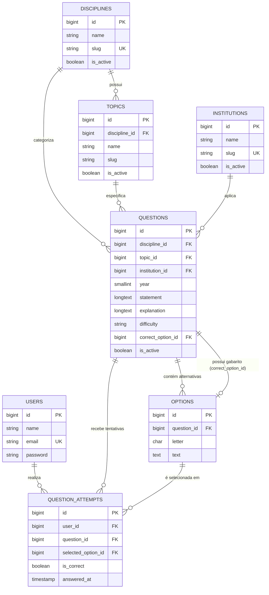

# Aprovei Direto 🚀

Plataforma web moderna, robusta e escalável para **estudo e resolução de questões de concursos públicos**, desenvolvida com arquitetura híbrida de alta performance baseada no ecossistema **Laravel 13.x**, **Inertia.js**, **React 18** e **TypeScript**, estilizada com **Tailwind CSS**, complementada por componentes **Filament**, **Livewire** e ambiente totalmente conteinerizado com **Docker (Laravel Sail)**.

---

## 📌 Visão Geral do Projeto

O **Aprovei Direto** combina a maturidade e poder do backend Laravel com a experiência fluida e reativa de uma Single Page Application (SPA) orientada a componentes React tipados via Inertia.js.

### Principais Capacidades da Plataforma:
- **Gestão Completa de Conteúdo de Concursos**: Estruturação hierárquica de Disciplinas, Tópicos/Assuntos, Bancas Examinadoras, Questões, Alternativas e Gabarito Oficial Comentado.
- **Motor de Resolução e Métricas**: Registro histórico de tentativas (`QuestionAttempt`), caderno de erros, controle de acertos e desempenho por disciplina, assunto ou banca.
- **Controle de Acesso Granular (RBAC)**: Gestão de papéis (`super_admin`, `admin`, `content_manager`, `support`, `user`) e permissões granulares via **Spatie Laravel Permission**.
- **Autenticação Dupla**: Autenticação Web por sessão via **Laravel Breeze** e autenticação por tokens de API via **Laravel Sanctum**.
- **Infraestrutura Conteinerizada**: Ambiente padronizado com **MySQL 8.4**, **Redis**, **Mailpit** e **Laravel Sail**.

---

## 🛠️ Stack Tecnológica Completa

### 🔹 Backend & Frameworks
| Tecnologia | Versão | Finalidade |
| :--- | :--- | :--- |
| **[PHP](https://www.php.net/)** | `^8.3` | Linguagem base do backend com tipagem estrita (`declare(strict_types=1);`) |
| **[Laravel](https://laravel.com/)** | `^13.x` | Framework MVC robusto, performático e expressivo |
| **[Laravel Breeze](https://laravel.com/docs/starter-kits#laravel-breeze)** | `^2.4` | Scaffolding de autenticação segura (Login, Registro, Redefinição de Senha, etc.) |
| **[Laravel Sanctum](https://laravel.com/docs/sanctum)** | `^4.0` | Autenticação por tokens para APIs REST e SPAs |
| **[Inertia.js Laravel Adapter](https://inertiajs.com/)** | `^2.0` | Conexão semântica e reativa entre Laravel e React sem necessidade de API intermediária |
| **[Spatie Laravel Permission](https://spatie.be/docs/laravel-permission/)** | `^8.3` | Gestão de perfis, papéis e permissões (RBAC) com cache automático |
| **[Filament](https://filamentphp.com/)** (Actions, Forms, Tables, Notifications, Support) | `^5.7` | Componentes avançados para formulários, tabelas e painéis administrativos |
| **[Livewire](https://livewire.laravel.com/)** | `^4.4` | Camada de reatividade server-side integrada ao ecossistema Filament |
| **[Tightenco Ziggy](https://github.com/tighten/ziggy)** | `^2.0` | Compartilhamento seguro de rotas nomeadas do Laravel no React/TypeScript |

### 🔹 Frontend & Interface (SPA)
| Tecnologia | Versão | Finalidade |
| :--- | :--- | :--- |
| **[React](https://react.dev/)** | `^18.2` | Biblioteca declarativa para construção de interfaces de usuário |
| **[TypeScript](https://www.typescriptlang.org/)** | `^5.0` | Tipagem estática para maior segurança, produtividade e manutenibilidade |
| **[Inertia.js React Adapter](https://inertiajs.com/)** | `^2.0` | Roteamento cliente-servidor sem recarregamento de página |
| **[Tailwind CSS](https://tailwindcss.com/)** | `^3.x / ^4.x` | Framework de CSS utilitário para estilização rápida, moderna e responsiva |
| **[Headless UI React](https://headlessui.com/)** | `^2.0` | Componentes de interface acessíveis e customizáveis (Modais, Menus, Dropdowns) |
| **[Vite](https://vitejs.dev/)** | `^8.0` | Bundler e build tool de última geração com Hot Module Replacement (HMR) ultrarrápido |

### 🔹 Infraestrutura, Banco de Dados & Cache (Docker)
| Serviço | Versão/Imagem | Descrição |
| :--- | :--- | :--- |
| **[Laravel Sail](https://laravel.com/docs/sail)** | `^1.67` | Ambiente de desenvolvimento conteinerizado sobre Docker Compose |
| **[MySQL](https://www.mysql.com/)** | `8.4` | Banco de dados relacional com integridade referencial e índices otimizados |
| **[Redis](https://redis.io/)** | `alpine` | Cache em memória de alta velocidade, armazenamento de sessões e filas |
| **[Mailpit](https://github.com/axllent/mailpit)** | `latest` | Servidor SMTP local e painel web para inspeção e teste de e-mails em desenvolvimento |

### 🔹 Qualidade de Código & Testes
| Ferramenta | Versão | Descrição |
| :--- | :--- | :--- |
| **[PHPUnit](https://phpunit.de/)** | `^12.5` | Suíte completa de testes automatizados unitários e de integração (Feature Tests) |
| **[Laravel Pint](https://laravel.com/docs/pint)** | `^1.27` | Padronizador e linter de código PHP baseado na PSR-12 |
| **[Laravel Pail](https://github.com/laravel/pail)** | `^1.2` | Streaming e monitoramento de logs em tempo real diretamente pelo terminal |
| **[Laravel Tinker](https://github.com/laravel/tinker)** | `^3.0` | REPL interativo para depuração, testes e comandos Eloquent |
| **[FakerPHP](https://fakerphp.org/)** & **[Mockery](https://packagist.org/packages/mockery/mockery)** | `^1.23` / `^1.6` | Geração de dados de teste (factories) e simulação de objetos (mocks) |

---

## 🏛️ Modelo de Domínio e Banco de Dados



### 🔹 Entidades do Domínio:
- **`Discipline`**: Disciplinas base de concursos (ex: Língua Portuguesa, Direito Constitucional, Raciocínio Lógico, etc.).
- **`Topic`**: Assuntos específicos pertencentes a uma disciplina (com restrição de unicidade em `[discipline_id, slug]`).
- **`Institution`**: Bancas examinadoras responsáveis pelas provas (ex: Cebraspe, FGV, FCC, Vunesp, etc.).
- **`Question`**: Questão de concurso com enunciado, resolução comentada, nível de dificuldade, ano e relacionamento com a alternativa correta.
- **`Option`**: Alternativas vinculadas à questão (letras A a E, com restrição de unicidade em `[question_id, letter]`).
- **`QuestionAttempt`**: Histórico detalhado de resolução do aluno com indicador de acerto (`is_correct`), data da resposta e índice composto `[user_id, question_id, answered_at]` para consulta ultrarrápida do caderno de erros e da última tentativa.
- **`QuestionDifficulty` (Enum)**: Níveis tipados: `VeryEasy` ("Muito Fácil"), `Easy` ("Fácil"), `Medium` ("Média"), `Hard` ("Difícil") e `VeryHard` ("Muito Difícil").

---

## 📂 Estrutura de Diretórios

```text
aprovei-direto/
├── app/
│   ├── Enums/                       # Enums nativos do PHP (QuestionDifficulty)
│   ├── Http/
│   │   ├── Api/                     # Controllers dedicados a APIs REST (HealthCheckController)
│   │   ├── Controllers/
│   │   │   ├── Auth/                # Fluxos de autenticação do Laravel Breeze
│   │   │   ├── ProfileController.php# Gerenciamento de perfil do usuário
│   │   │   └── Controller.php
│   │   ├── Middleware/              # Middlewares HTTP (HandleInertiaRequests)
│   │   └── Requests/                # Form Requests tipados de validação
│   ├── Models/                      # Models Eloquent (Discipline, Topic, Institution, Question, Option, QuestionAttempt, User)
│   └── Providers/                   # Service Providers da aplicação
├── bootstrap/                       # Inicialização da aplicação, rotas e exceções (app.php, providers.php)
├── config/                          # Configurações globais (app, auth, database, permission, sanctum, etc.)
├── database/
│   ├── factories/                   # Factories para todas as entidades de domínio
│   ├── migrations/                  # Migrações do banco de dados com integridade referencial
│   └── seeders/                     # Seeders completos (Roles/Permissions, Disciplines, Institutions, Questions)
├── resources/
│   ├── css/                         # Folhas de estilo e configurações do Tailwind CSS
│   ├── js/
│   │   ├── Components/              # Componentes de interface React reutilizáveis
│   │   ├── Layouts/                 # Layouts de página (AuthenticatedLayout, GuestLayout)
│   │   ├── Pages/                   # Páginas SPA renderizadas pelo Inertia (Auth, Dashboard, Profile, Welcome)
│   │   ├── types/                   # Definições globais de tipos TypeScript
│   │   └── app.tsx                  # Ponto de montagem da SPA React/Inertia
│   └── views/
│       └── app.blade.php            # Template Blade raiz
├── routes/
│   ├── api.php                      # Rotas de API protegidas com Laravel Sanctum
│   ├── auth.php                     # Rotas de autenticação (Breeze)
│   ├── console.php                  # Comandos Artisan customizados
│   └── web.php                      # Rotas principais da aplicação Web
├── tests/
│   ├── Feature/
│   │   ├── Auth/                    # Testes de autenticação e segurança
│   │   ├── Domain/                  # Testes do núcleo de domínio de questões (QuestionDomainTest)
│   │   └── ProfileTest.php          # Testes de perfil do usuário
│   └── Unit/                        # Testes unitários
├── compose.yaml                     # Configuração Docker (Sail, MySQL 8.4, Redis, Mailpit)
├── composer.json                    # Dependências e scripts do ecossistema PHP
├── package.json                     # Dependências e scripts do ecossistema Node/React/Vite
├── phpunit.xml                      # Configuração da suíte de testes PHPUnit
└── vite.config.js                   # Configurações do Vite e plugins
```

---

## 🚀 Como Executar o Projeto

### Pré-requisitos
- **Docker** e **Docker Compose** instalados (Recomendado via Laravel Sail)
- *Ou para execução local:*
  - **PHP >= 8.3** e **Composer**
  - **Node.js >= 20.x** e **NPM**
  - **MySQL >= 8.0** ou **SQLite**
  - **Redis**

---

### Opção 1: Execução com Docker / Laravel Sail (Recomendado)

1. **Clone o repositório:**
   ```bash
   git clone <URL_DO_REPOSITORIO>
   cd aprovei-direto
   ```

2. **Configure o arquivo de ambiente:**
   ```bash
   cp .env.example .env
   ```

3. **Inicie os containers da infraestrutura:**
   ```bash
   ./vendor/bin/sail up -d
   ```

4. **Gere a chave da aplicação e execute as migrações com os seeders:**
   ```bash
   ./vendor/bin/sail artisan key:generate
   ./vendor/bin/sail artisan migrate:fresh --seed
   ```

5. **Inicie o servidor de desenvolvimento do frontend (Vite):**
   ```bash
   ./vendor/bin/sail npm install
   ./vendor/bin/sail npm run dev
   ```

---

### Opção 2: Execução Local (Sem Docker)

1. **Instale as dependências:**
   ```bash
   composer install
   npm install
   ```

2. **Configure o `.env` e gere a chave:**
   ```bash
   cp .env.example .env
   php artisan key:generate
   ```

3. **Execute as migrações e popule o banco de dados:**
   ```bash
   php artisan migrate:fresh --seed
   ```

4. **Inicie os servidores de desenvolvimento:**
   ```bash
   # Inicia Laravel, Vite e filas simultaneamente
   composer run dev
   ```

---

## 🔑 Credenciais Padrão de Desenvolvimento

Após rodar o comando `migrate:fresh --seed`, os seguintes usuários de teste estarão disponíveis:

| Perfil / Papel | E-mail | Senha | Acesso / Permissões |
| :--- | :--- | :--- | :--- |
| **Super Administrador** | `admin@aproveidireto.com.br` | `password` | Acesso irrestrito a todas as funções e cadastros |
| **Aluno / Concurseiro** | `test@example.com` | `password` | Acesso à resolução de questões e estatísticas |

---

## 🌐 Portas & Serviços Disponíveis

| Serviço | Porta Padrão | URL / Descrição |
| :--- | :--- | :--- |
| **Aplicação Web (Laravel / Sail)** | `80` (Sail) / `8000` (Local) | [http://localhost:8000](http://localhost:8000) |
| **Vite Dev Server (HMR)** | `5173` | [http://localhost:5173](http://localhost:5173) |
| **Mailpit (Web Interface)** | `8025` | [http://localhost:8025](http://localhost:8025) (Caixa de entrada local de e-mails) |
| **Mailpit (SMTP Server)** | `1025` | Conexão SMTP para envio de e-mails em desenvolvimento |
| **MySQL** | `3306` | Banco de dados relacional principal |
| **Redis** | `6379` | Cache, sessões e filas |
| **Health Check (Nativo)** | `/up` | Endpoint de verificação de integridade |

---

## 🧪 Testes Automatizados & Qualidade de Código

O projeto conta com suíte automatizada completa utilizando **PHPUnit**:

```bash
# Executar toda a suíte de testes (Feature e Unit)
./vendor/bin/sail artisan test

# Executar exclusivamente os testes de domínio de questões
./vendor/bin/sail artisan test --filter QuestionDomainTest

# Executar o formatador e linter de código (Laravel Pint - PSR-12)
./vendor/bin/sail pint

# Monitorar logs em tempo real
./vendor/bin/sail artisan pail
```

---

## 📜 Licença

Este projeto está sob a licença [MIT](LICENSE).
