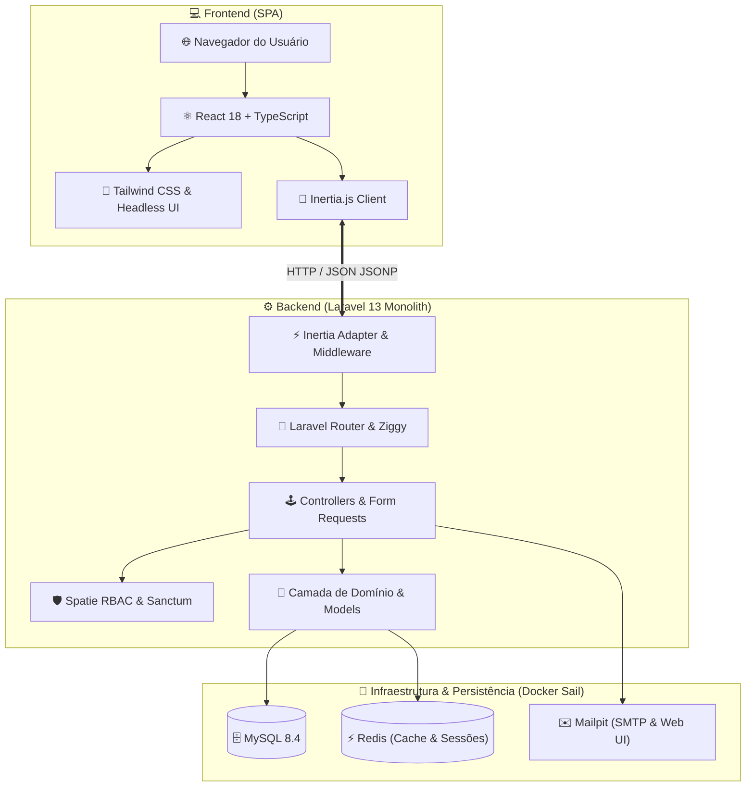
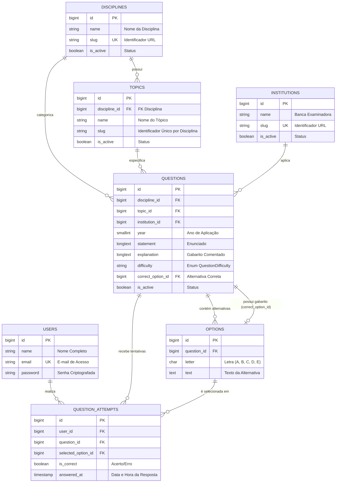

<div align="center">

# 🚀 APROVEI DIRETO
### *A Plataforma Definitiva de Alta Performance para Concurseiros*

[](https://laravel.com)
[](https://react.dev)
[](https://www.typescriptlang.org/)
[](https://tailwindcss.com)
[](https://inertiajs.com)
[](https://laravel.com/docs/sail)
[](#-testes-automatizados--qualidade)
[](https://opensource.org/licenses/MIT)

<br/>

<p align="center">
  <b>Monólito Moderno e Reativo</b> • <b>Single Page Application (SPA)</b> • <b>Controle de Acesso RBAC</b> • <b>Motor Inteligente de Questões</b>
</p>

<p align="center">
  <a href="#-visão-geral">Visão Geral</a> •
  <a href="#-principais-funcionalidades">Funcionalidades</a> •
  <a href="#-arquitetura-e-fluxo">Arquitetura</a> •
  <a href="#-modelo-de-dados">Modelo de Dados</a> •
  <a href="#-início-rápido">Início Rápido</a> •
  <a href="#-credenciais-de-acesso">Credenciais</a> •
  <a href="#-roadmap">Roadmap</a>
</p>

---

</div>

## 💡 Visão Geral

O **Aprovei Direto** foi idealizado para transformar o estudo para concursos públicos no Brasil através de uma experiência de usuário **instantânea, sem recarregamento de página** e com **análise profunda de métricas de aprendizado**.

Construído sobre o poderoso ecossistema **Laravel + Inertia.js + React (TypeScript)**, o projeto elimina o custo de manter uma API REST separada para interfaces internas enquanto entrega a interatividade de uma aplicação frontend de ponta.

> [!TIP]
> **Por que este projeto se destaca?**
> - ⚡ **Experiência SPA sem complexidade de API**: Graças ao Inertia.js 2.0.
> - 🎯 **Domínio Rico & Tipado**: Tipagem estrita com PHP 8.3 (`declare(strict_types=1);`), Enums nativos e Models Eloquent robustas.
> - 🛡️ **Segurança e RBAC**: Permissões e papéis gerenciados com Spatie Permission + autenticação dupla (Breeze por Sessão e Sanctum por Tokens).
> - 🐳 **100% Conteinerizado**: Zero esforço de setup com Docker e Laravel Sail.

---

## ✨ Principais Funcionalidades

<table>
  <tr>
    <td width="50%">
      <h3 align="center">📚 Gestão de Conteúdo</h3>
      <ul>
        <li><b>Taxonomia Completa:</b> Disciplinas, Assuntos/Tópicos hierárquicos e Bancas Examinadoras (Cebraspe, FGV, FCC, Vunesp, etc.).</li>
        <li><b>Questões com Gabarito Comentado:</b> Enunciados ricos, 5 alternativas (A-E) e explicações didáticas detalhadas.</li>
        <li><b>Níveis de Dificuldade:</b> Classificação por Enum (<i>Muito Fácil</i> a <i>Muito Difícil</i>).</li>
      </ul>
    </td>
    <td width="50%">
      <h3 align="center">📊 Resolução & Métricas</h3>
      <ul>
        <li><b>Histórico de Tentativas:</b> Registro em tempo real de cada resolução do estudante.</li>
        <li><b>Caderno de Erros Inteligente:</b> Acesso instantâneo a questões erradas para revisão focada.</li>
        <li><b>Performance Otimizada:</b> Índices compostos de banco de dados para consultas em milissegundos.</li>
      </ul>
    </td>
  </tr>
  <tr>
    <td width="50%">
      <h3 align="center">🔐 Segurança & Perfis (RBAC)</h3>
      <ul>
        <li><b>Papéis Pré-configurados:</b> <code>super_admin</code>, <code>admin</code>, <code>content_manager</code>, <code>support</code> e <code>user</code>.</li>
        <li><b>Permissões Granulares:</b> Controle estrito sobre CRUD de questões, bancas e usuários.</li>
        <li><b>Autenticação Híbrida:</b> Sessão web + API Tokens via Laravel Sanctum.</li>
      </ul>
    </td>
    <td width="50%">
      <h3 align="center">⚡ Experiência do Desenvolvedor (DX)</h3>
      <ul>
        <li><b>Docker Integrado:</b> MySQL 8.4, Redis e Mailpit configurados e orquestrados.</li>
        <li><b>Qualidade de Código:</b> Linter PSR-12 automático (Laravel Pint) e suite de testes completa (PHPUnit).</li>
        <li><b>Logs em Tempo Real:</b> Monitoramento de logs pelo terminal com Laravel Pail.</li>
      </ul>
    </td>
  </tr>
</table>

---

## 🏗️ Arquitetura e Fluxo do Sistema



---

## 🗄️ Modelo de Dados & Relacionamentos

<details open>
<summary><b>📊 Clique para expandir/recolher o Diagrama Entidade-Relacionamento (ERD)</b></summary>
<br/>


</details>

---

## ⚡ Início Rápido (Quickstart)

> [!IMPORTANT]
> Certifique-se de ter o **Docker Desktop** ou **Docker Engine** em execução no seu sistema operacional.

### 1️⃣ Clonar o Repositório e Configurar Ambiente
```bash
git clone https://github.com/jedunatal/aprovei-direto.git
cd aprovei-direto
cp .env.example .env
```

### 2️⃣ Inicializar os Containers com Laravel Sail
```bash
# Inicia todos os serviços em segundo plano (App, MySQL, Redis, Mailpit)
./vendor/bin/sail up -d
```

### 3️⃣ Gerar Chave, Rodar Migrações e Popular Dados
```bash
./vendor/bin/sail artisan key:generate
./vendor/bin/sail artisan migrate:fresh --seed
```

### 4️⃣ Compilar e Iniciar o Frontend (Vite)
```bash
./vendor/bin/sail npm install
./vendor/bin/sail npm run dev
```

---

## 🌐 Painel de Serviços & Portas

Acesse os serviços locais através dos links abaixo:

| Serviço | Porta | Link Direto | Finalidade |
| :--- | :---: | :--- | :--- |
| 🚀 **Aplicação Web** | `80` (Sail) / `8000` | [http://localhost:8000](http://localhost:8000) | Interface principal do aluno e login |
| ⚡ **Vite HMR Server** | `5173` | [http://localhost:5173](http://localhost:5173) | Hot Reload para desenvolvimento React |
| ✉️ **Mailpit (Web UI)** | `8025` | [http://localhost:8025](http://localhost:8025) | Inspeção de e-mails disparados localmente |
| 🗄️ **MySQL 8.4** | `3306` | `localhost:3306` | Conexão externa com banco de dados |
| 🔴 **Redis** | `6379` | `localhost:6379` | Cache e mensageria |
| 🩺 **Health Check** | `/up` | [http://localhost:8000/up](http://localhost:8000/up) | Diagnóstico e disponibilidade do app |

---

## 🔑 Credenciais de Acesso Pré-configuradas

Os seeders criam automaticamente contas de teste prontas para uso:

<details open>
<summary><b>👤 Clique para visualizar as contas de desenvolvimento</b></summary>
<br/>

| Perfil | E-mail | Senha | Acesso / Permissões |
| :--- | :--- | :--- | :--- |
| 👑 **Super Admin** | `admin@aproveidireto.com.br` | `password` | Acesso completo a todas as áreas, permissões e configurações |
| 🎓 **Aluno / Concurseiro** | `test@example.com` | `password` | Acesso à resolução de simulados, histórico e estatísticas |

</details>

---

## 🧪 Testes Automatizados & Qualidade

A integridade do código e as regras de negócio de domínio são validadas através de testes automatizados com **PHPUnit**:

```bash
# 🧪 Executar toda a suíte de testes
./vendor/bin/sail artisan test

# 🎯 Executar apenas os testes de domínio de questões
./vendor/bin/sail artisan test --filter QuestionDomainTest

# 🎨 Formatar e validar padrão de código PSR-12 (Laravel Pint)
./vendor/bin/sail pint

# 📡 Monitorar logs da aplicação em tempo real
./vendor/bin/sail artisan pail
```

<div align="center">
  
  
  
</div>

---

## 📂 Mapa Estrutural do Repositório

<details>
<summary><b>📁 Clique para visualizar a árvore completa de diretórios</b></summary>
<br/>

```text
aprovei-direto/
├── app/
│   ├── Enums/                       # Enums tipados do PHP (QuestionDifficulty)
│   ├── Http/
│   │   ├── Api/                     # Controllers dedicados a endpoints de API (HealthCheck)
│   │   ├── Controllers/
│   │   │   ├── Auth/                # Fluxos de autenticação (Breeze)
│   │   │   ├── ProfileController.php# Gerenciamento de perfil
│   │   │   └── Controller.php
│   │   ├── Middleware/              # Middlewares HTTP (HandleInertiaRequests)
│   │   └── Requests/                # Validações tipadas (Form Requests)
│   ├── Models/                      # Models Eloquent (Discipline, Topic, Institution, Question, Option, QuestionAttempt, User)
│   └── Providers/                   # Service Providers da aplicação
├── bootstrap/                       # Inicialização do framework (app.php, providers.php)
├── config/                          # Configurações globais (auth, database, permission, sanctum, etc.)
├── database/
│   ├── factories/                   # Factories com geradores de dados para todas as models
│   ├── migrations/                  # Migrações com chaves estrangeiras e índices compostos
│   └── seeders/                     # Seeders para RBAC, disciplinas, tópicos, bancas e questões
├── resources/
│   ├── css/                         # Estilos Tailwind CSS
│   ├── js/
│   │   ├── Components/              # Componentes de interface React reutilizáveis
│   │   ├── Layouts/                 # Layouts (Authenticated, Guest)
│   │   ├── Pages/                   # Páginas da SPA (Auth, Dashboard, Profile, Welcome)
│   │   ├── types/                   # Tipagens TypeScript (props, ziggy, models)
│   │   └── app.tsx                  # Ponto de entrada do React/Inertia
│   └── views/
│       └── app.blade.php            # Template HTML raiz
├── routes/
│   ├── api.php                      # Rotas de API protegidas com Sanctum
│   ├── auth.php                     # Rotas de autenticação
│   ├── console.php                  # Comandos Artisan customizados
│   └── web.php                      # Rotas principais da aplicação
├── tests/
│   ├── Feature/
│   │   ├── Auth/                    # Testes de autenticação e sessão
│   │   ├── Domain/                  # Testes do motor de questões e integridade (QuestionDomainTest)
│   │   └── ProfileTest.php          # Testes de perfil
│   └── Unit/                        # Testes unitários
├── compose.yaml                     # Orquestração Docker (App, MySQL 8.4, Redis, Mailpit)
├── composer.json                    # Dependências do backend PHP
├── package.json                     # Dependências do frontend Node/React
├── phpunit.xml                      # Configurações de testes
└── vite.config.js                   # Configurações do Vite
```
</details>

---

## 🗺️ Roadmap de Desenvolvimento

- [x] **Fase 1: Fundação & Autenticação** *(Scaffolding, Breeze, Sanctum, Docker Sail, RBAC Spatie)*
- [x] **Fase 2: Modelagem de Domínio & Questões** *(Disciplinas, Tópicos, Bancas, Questões, Alternativas, Tentativas, Seeders, Testes)*
- [ ] **Fase 3: Interface do Aluno & Feed de Questões** *(Filtros combinados, tela de resolução interativa com feedback imediato)*
- [ ] **Fase 4: Painel Administrativo Filament** *(Gestão visual de questões, importador em lote e moderação)*
- [ ] **Fase 5: Métricas & Estatísticas Avançadas** *(Gráficos de evolução, taxa de acertos por disciplina e comparativos)*
- [ ] **Fase 6: Simulados & Cadernos Personalizados** *(Geração de simulados cronometrados e exportação em PDF)*

---

<div align="center">

Desenvolvido com dedicação para concurseiros de todo o Brasil 🇧🇷<br/>
<sub>Distribuído sob a licença <a href="LICENSE">MIT</a>.</sub>

</div>
