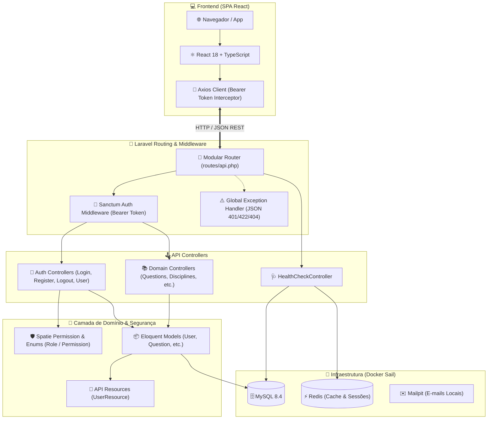

<div align="center">

# 🚀 APROVEI DIRETO
### *A Plataforma Definitiva de Alta Performance para Concurseiros*

[](https://laravel.com)
[](https://react.dev)
[](https://www.typescriptlang.org/)
[](https://laravel.com/docs/sanctum)
[](https://tailwindcss.com)
[](https://laravel.com/docs/sail)
[](#-testes-automatizados--qualidade)
[](https://opensource.org/licenses/MIT)

<br/>

<p align="center">
  <b>Arquitetura RESTful Modular</b> • <b>SPA React + TypeScript</b> • <b>Autenticação Headless (Sanctum)</b> • <b>Controle de Acesso RBAC com Enums Nativos</b>
</p>

<p align="center">
  <a href="#-visão-geral">Visão Geral</a> •
  <a href="#-principais-recursos">Recursos</a> •
  <a href="#-arquitetura-do-sistema">Arquitetura</a> •
  <a href="#-catálogo-de-rotas-e-endpoints">Endpoints API</a> •
  <a href="#-controle-de-acesso-rbac">RBAC & Permissões</a> •
  <a href="#-início-rápido">Início Rápido</a> •
  <a href="#-credenciais-de-desenvolvimento">Credenciais</a> •
  <a href="#-roadmap">Roadmap</a>
</p>

---

</div>

## 💡 Visão Geral

O **Aprovei Direto** é uma plataforma de tecnologia educacional moderna voltada para a preparação de alto rendimento para concursos públicos. 

O sistema foi desenhado com uma **arquitetura de API RESTful desacoplada e modularizada**, fornecendo segurança rigorosa através de **Laravel Sanctum (Tokens Bearer + Stateful SPA)**, controle de acesso baseado em papéis (**RBAC**) com **Enums nativos do PHP 8.3**, respostas JSON padronizadas e integração reativa com **React 18** e **TypeScript**.

> [!TIP]
> **Destaques Arquiteturais:**
> - 🔑 **Autenticação Headless com Sanctum**: Endpoints REST para registro, login com suporte a múltiplos dispositivos, logout com revogação de tokens e busca de perfil.
> - 🛡️ **RBAC Tipado com Enums**: Papéis (`SuperAdmin`, `Admin`, `Teacher`, `Student`, `Support`) e mais de 25 permissões granulares gerenciadas via Spatie Permission e Enums PHP nativos.
> - 🧩 **Rotas de API Modularizadas**: Roteamento organizado por domínios em `routes/api/` (Auth, Questões, Disciplinas, Tópicos, Bancas, Dashboard, Assinaturas e Pagamentos).
> - 🎯 **Tratamento Global de Exceções**: Respostas JSON consistentes para erros de validação (`422`), autenticação (`401`) e recursos inexistentes (`404`).
> - 🐳 **Ambiente 100% Dockerizado**: MySQL 8.4, Redis e Mailpit orquestrados via Laravel Sail.

---

## ✨ Principais Recursos

<table>
  <tr>
    <td width="50%">
      <h3 align="center">🔐 Autenticação & Segurança</h3>
      <ul>
        <li><b>Headless Auth REST:</b> Endpoints dedicados para <code>/api/auth/*</code> com emissão de Bearer tokens.</li>
        <li><b>Perfil Automático:</b> Novos usuários registrados recebem automaticamente a role <code>student</code> dentro de transação atômica.</li>
        <li><b>Revogação Instantânea:</b> Endpoint de logout que deleta o token ativo no banco de dados.</li>
      </ul>
    </td>
    <td width="50%">
      <h3 align="center">🛡️ Controle de Acesso (RBAC)</h3>
      <ul>
        <li><b>Enums Nativos:</b> Catálogo centralizado em <code>App\Enums\Role</code> e <code>App\Enums\Permission</code>.</li>
        <li><b>Hierarquia de 5 Níveis:</b> Super Admin (acesso total), Admin, Teacher (gestão de conteúdo), Student (resolução e dashboard) e Support.</li>
        <li><b>UserResource:</b> Payload da API retorna automaticamente a lista de roles e permissões do usuário.</li>
      </ul>
    </td>
  </tr>
  <tr>
    <td width="50%">
      <h3 align="center">🧩 API REST Modular</h3>
      <ul>
        <li><b>Separação por Domínios:</b> Módulos isolados em arquivos <code>routes/api/*.php</code>.</li>
        <li><b>Formatadores JSON:</b> Recursos API Resources desacoplam o modelo de dados da representação externa.</li>
        <li><b>Health Check:</b> Endpoint <code>GET /api/health</code> para monitoramento em tempo real do MySQL e Redis.</li>
      </ul>
    </td>
    <td width="50%">
      <h3 align="center">⚡ Qualidade & DevOps (DX)</h3>
      <ul>
        <li><b>Testes Automatizados:</b> 100% dos fluxos de API validados com PHPUnit.</li>
        <li><b>Padronização PSR-12:</b> Formatação de código automatizada com Laravel Pint.</li>
        <li><b>Infraestrutura Sail:</b> Containers pré-configurados com MySQL 8.4, Redis e Mailpit.</li>
      </ul>
    </td>
  </tr>
</table>

---

## 🏗️ Arquitetura do Sistema



---

## 🌐 Catálogo de Rotas e Endpoints da API

<details open>
<summary><b>📋 Clique para expandir/recolher a tabela de endpoints disponíveis</b></summary>
<br/>

| Método | Endpoint | Middleware | Descrição |
| :---: | :--- | :---: | :--- |
| `POST` | `/api/auth/register` | `guest` | Cadastra novo usuário, atribui role `student` e retorna Bearer token |
| `POST` | `/api/auth/login` | `guest` | Autentica usuário com e-mail/senha e emite token Sanctum |
| `GET` | `/api/auth/user` | `auth:sanctum` | Retorna os dados, roles e permissões do usuário logado |
| `POST` | `/api/auth/logout` | `auth:sanctum` | Revoga e deleta o token Bearer atual |
| `GET` | `/api/health` | Público | Retorna o status de integridade do MySQL e Redis |
| `GET` | `/up` | Público | Endpoint nativo de health check do Laravel |
| `*` | `/api/questions/*` | `auth:sanctum` | Módulo de questões de concursos *(Modular)* |
| `*` | `/api/disciplines/*` | `auth:sanctum` | Módulo de disciplinas *(Modular)* |
| `*` | `/api/topics/*` | `auth:sanctum` | Módulo de tópicos e assuntos *(Modular)* |
| `*` | `/api/institutions/*` | `auth:sanctum` | Módulo de bancas examinadoras *(Modular)* |
| `*` | `/api/dashboard/*` | `auth:sanctum` | Módulo de estatísticas do aluno *(Modular)* |
| `*` | `/api/subscriptions/*` | `auth:sanctum` | Módulo de assinaturas e planos *(Modular)* |
| `*` | `/api/payments/*` | `auth:sanctum` | Módulo de pagamentos *(Modular)* |

</details>

---

## 🛡️ Controle de Acesso (RBAC)

O sistema conta com um modelo rigoroso de permissões tipadas em Enums nativos do PHP:

```text
├── App\Enums\Role (Papéis)
│   ├── SuperAdmin ('super_admin') -> Acesso irrestrito a todo o sistema
│   ├── Admin ('admin')            -> Gestão operacional, relatórios e usuários
│   ├── Teacher ('teacher')        -> Gestão de questões, disciplinas e bancas
│   ├── Student ('student')        -> Resolução de questões, simulados e dashboard
│   └── Support ('support')        -> Atendimento e visualização de assinaturas
│
└── App\Enums\Permission (Permissões Granulares)
    ├── questions.{view, create, update, delete}
    ├── disciplines.{view, create, update, delete}
    ├── topics.{view, create, update, delete}
    ├── institutions.{view, create, update, delete}
    ├── users.{view, create, update, delete}
    ├── subscriptions.{view, manage}
    ├── payments.{view, manage}
    └── dashboard.view
```

---

## ⚡ Início Rápido (Quickstart)

> [!IMPORTANT]
> Certifique-se de possuir o **Docker Desktop** ou **Docker Engine** em execução no seu ambiente.

### 1️⃣ Clonar o Repositório e Configurar o `.env`
```bash
git clone https://github.com/jedunatal/aprovei-direto.git
cd aprovei-direto
cp .env.example .env
```

### 2️⃣ Inicializar os Containers com Laravel Sail
```bash
./vendor/bin/sail up -d
```

### 3️⃣ Gerar Chave da Aplicação e Rodar Seeds com RBAC
```bash
./vendor/bin/sail artisan key:generate
./vendor/bin/sail artisan migrate:fresh --seed
```

### 4️⃣ Iniciar o Servidor Frontend (Vite)
```bash
./vendor/bin/sail npm install
./vendor/bin/sail npm run dev
```

---

## 🔑 Credenciais de Desenvolvimento

Após a execução do comando `migrate:fresh --seed`, a conta de Super Administrador estará pronta:

| Papel | E-mail | Senha | Acesso / Permissões |
| :--- | :--- | :--- | :--- |
| 👑 **Super Administrador** | `admin@aproveidireto.com.br` | `Admin@Aprovei2026` | Acesso total a todos os endpoints, permissões e cadastros |

---

## 🌐 Painel de Serviços & Portas

| Serviço | Porta | Link / Host | Finalidade |
| :--- | :---: | :--- | :--- |
| 🚀 **API / Aplicação Web** | `80` (Sail) / `8000` | [http://localhost:8000](http://localhost:8000) | Servidor da API REST e SPA |
| ⚡ **Vite Dev Server** | `5173` | [http://localhost:5173](http://localhost:5173) | Hot Module Replacement (HMR) React |
| ✉️ **Mailpit (Web UI)** | `8025` | [http://localhost:8025](http://localhost:8025) | Painel web para inspeção de e-mails |
| 🗄️ **MySQL 8.4** | `3306` | `localhost:3306` | Banco de dados relacional |
| 🔴 **Redis** | `6379` | `localhost:6379` | Cache e sessões |
| 🩺 **Health Check** | `/api/health` | [http://localhost:8000/api/health](http://localhost:8000/api/health) | Diagnóstico da infraestrutura (MySQL + Redis) |

---

## 🧪 Testes Automatizados & Qualidade

A integridade dos endpoints da API e da hierarquia de permissões é validada por testes automatizados com **PHPUnit**:

```bash
# 🧪 Executar os testes de API (Auth & Hierarquia RBAC)
./vendor/bin/sail artisan test tests/Feature/Api

# 🎯 Executar toda a suíte de testes do projeto
./vendor/bin/sail artisan test

# 🎨 Formatar e validar padrão de código PSR-12 (Laravel Pint)
./vendor/bin/sail pint

# 📡 Monitorar logs da aplicação em tempo real
./vendor/bin/sail artisan pail
```

<div align="center">
  
  
  
</div>

---

## 📂 Mapa Estrutural do Repositório

<details>
<summary><b>📁 Clique para expandir a estrutura de diretórios</b></summary>
<br/>

```text
aprovei-direto/
├── app/
│   ├── Enums/                       # Enums nativos do PHP (Role, Permission)
│   ├── Http/
│   │   ├── Controllers/
│   │   │   └── Api/
│   │   │       ├── Auth/            # Controllers de autenticação (Login, Register, Logout, CurrentUser)
│   │   │       └── HealthCheckController.php
│   │   ├── Requests/
│   │   │   └── Auth/                # Form Requests de validação da API (ApiLoginRequest, ApiRegisterRequest)
│   │   ├── Resources/               # API Resources para formatação de respostas JSON (UserResource)
│   │   └── Middleware/              # Middlewares HTTP da aplicação
│   ├── Models/                      # Models Eloquent (User, etc.)
│   └── Providers/                   # Service Providers
├── bootstrap/                       # Configuração da aplicação, middlewares e exception handlers (app.php)
├── config/                          # Configurações globais (sanctum, permission, database, etc.)
├── database/
│   ├── migrations/                  # Migrações do banco de dados (users, tokens, permissões, etc.)
│   └── seeders/                     # Seeders para RBAC (RolePermissionSeeder)
├── resources/
│   ├── js/
│   │   ├── api/                     # Cliente HTTP (axios.ts)
│   │   ├── Components/              # Componentes de interface React
│   │   ├── Layouts/                 # Layouts de página
│   │   ├── Pages/                   # Páginas da SPA React
│   │   └── app.tsx                  # Ponto de entrada do frontend
│   └── views/
│       └── app.blade.php            # Template HTML raiz
├── routes/
│   ├── api/                         # Rotas modulares por domínio (auth, health, questions, etc.)
│   ├── api.php                      # Ponto de entrada das rotas de API
│   ├── console.php                  # Comandos Artisan
│   └── web.php                      # Rotas da interface web
├── tests/
│   └── Feature/
│       └── Api/                     # Testes automatizados da API (AuthTest, HierarchyTest)
├── compose.yaml                     # Orquestração Docker (App, MySQL 8.4, Redis, Mailpit)
├── composer.json                    # Dependências do backend PHP
├── package.json                     # Dependências do frontend Node/React
└── vite.config.js                   # Configurações do Vite
```
</details>

---

## 🗺️ Roadmap de Desenvolvimento

- [x] **Fase 1: Infraestrutura & Docker Sail** *(MySQL 8.4, Redis, Mailpit, Laravel 13)*
- [x] **Fase 2: Autenticação RESTful com Sanctum** *(Register, Login, Logout, CurrentUser, Tokens Bearer)*
- [x] **Fase 3: Controle de Acesso (RBAC) com Enums** *(Papéis, Permissões granulares, Spatie, Seeders)*
- [x] **Fase 4: Tratamento de Exceções & Respostas JSON** *(Handler global para 401, 422, 404)*
- [ ] **Fase 5: Módulos de Domínio da API** *(Endpoints CRUD de Questões, Disciplinas, Tópicos e Bancas)*
- [ ] **Fase 6: Integração Frontend React com Axios** *(Interceptors de autenticação, telas de Login/Cadastro/Dashboard)*
- [ ] **Fase 7: Motor de Resolução & Caderno de Erros** *(Submissão de respostas, cálculo de pontuação e histórico)*
- [ ] **Fase 8: Painel Administrativo** *(Gestão de conteúdo e moderação de questões)*

---

<div align="center">

Desenvolvido com excelência para concurseiros de todo o Brasil 🇧🇷<br/>
<sub>Distribuído sob a licença <a href="LICENSE">MIT</a>.</sub>

</div>
